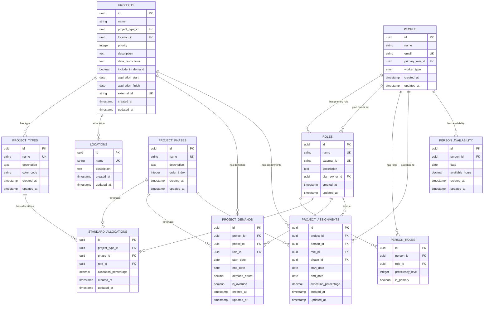
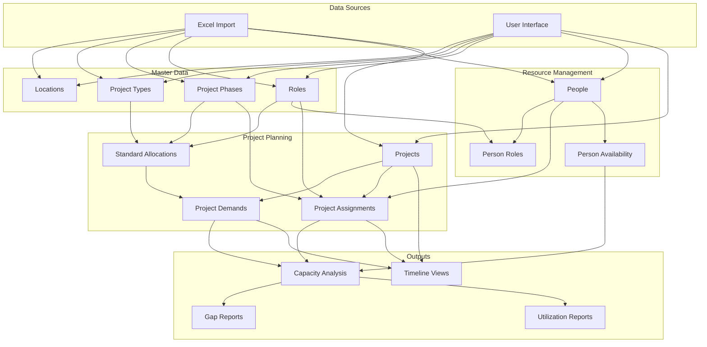
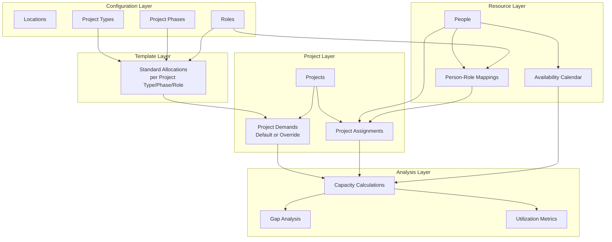

# Data Architecture Diagram

## Entity Relationship Diagram

## Data Flow Diagram

## Data Hierarchy

## Key Relationships Explained

### 1. **Standard Allocations → Project Demands**
- When a project is created with a specific type, standard allocations automatically generate default demands
- These can be overridden for specific date ranges

### 2. **People → Roles (Many-to-Many)**
- Each person has one primary role
- Can have multiple secondary roles with proficiency levels
- This enables flexible resource assignment

### 3. **Projects → Assignments → People**
- Projects have demands (what's needed)
- Assignments link people to projects (who's doing it)
- Assignments must respect person's available roles

### 4. **Availability → Capacity**
- Person availability sets working hours per day
- Assignments consume available capacity
- System calculates utilization and gaps

## Data Integrity Rules

1. **Cascading Deletes**:
   - Deleting a person removes their assignments and availability
   - Deleting a project removes its demands and assignments
   - Cannot delete roles/phases/types with active projects

2. **Unique Constraints**:
   - One standard allocation per project type/phase/role combination
   - One availability entry per person/date
   - Unique person-role combinations

3. **Business Rules**:
   - Assignment dates must fall within project dates
   - Allocation percentages cannot exceed 100% per person/day
   - Demands must have valid start/end dates