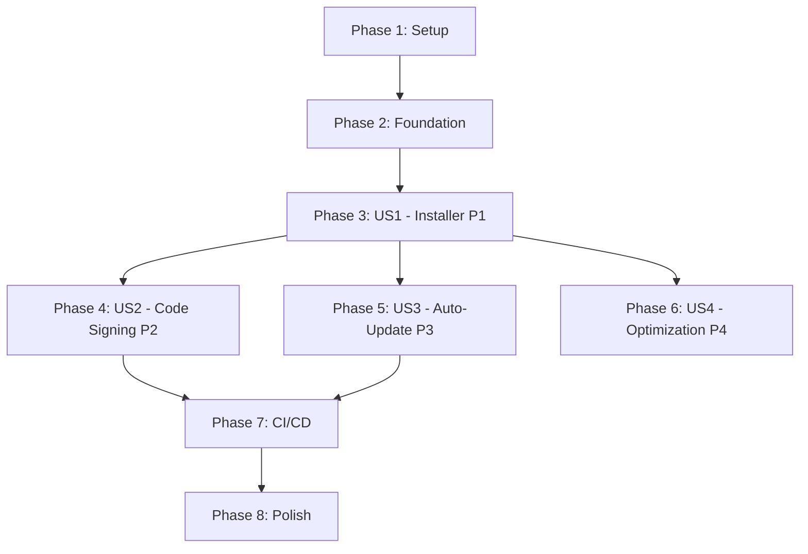

# Tasks: Windows Build Process Refinement

**Input**: Design documents from `/specs/002-windows-build-refinement/`
**Prerequisites**: plan.md, spec.md, research.md, quickstart.md

**Tests**: This feature focuses on build infrastructure. Manual testing is required (installer validation on clean Windows VM). No automated test tasks included unless explicitly added later.

**Organization**: Tasks are grouped by user story priority (P1 → P4) to enable independent implementation and incremental delivery.

## Format: `[ID] [P?] [Story] Description`

- **[P]**: Can run in parallel (different files, no dependencies)
- **[Story]**: Which user story this task belongs to (US1, US2, US3, US4)
- Include exact file paths in descriptions

## Path Conventions

This feature modifies build configuration and Electron infrastructure:
- `package.json` - electron-builder configuration
- `build/` - NSIS installer customization scripts
- `src/electron/` - Electron main process and auto-updater
- `.github/workflows/` - CI/CD automation
- `docs/` - Build documentation

---

## Phase 1: Setup (Shared Infrastructure)

**Purpose**: Prepare build infrastructure and directories

- [x] T001 Create `build/` directory for NSIS installer resources
- [x] T002 Move Windows icon from `assets/icon.ico` to `build/icon.ico` (if not already there)
- [x] T003 [P] Verify electron-builder 26.0.12 is installed in package.json devDependencies

---

## Phase 2: Foundational (Blocking Prerequisites)

**Purpose**: Core build configuration that all user stories depend on

**⚠️ CRITICAL**: These tasks establish the baseline build system before enhancements

- [x] T004 Audit current electron-builder configuration in package.json "build" section
- [x] T005 Document current build process baseline (build time, installer size, file count)
- [x] T006 [P] Create backup of current package.json build configuration

**Checkpoint**: Baseline documented - user story implementation can now begin

---

## Phase 3: User Story 1 - Reliable Windows Installer Generation (Priority: P1) 🎯 MVP

**Goal**: Generate a Windows NSIS installer that bundles all components, creates shortcuts, and installs correctly on clean Windows machines

**Independent Test**: Run `npm run dist:win`, install the generated .exe on a clean Windows 10/11 VM, verify application launches and core features work (create project, assign resources)

### Implementation for User Story 1

- [x] T007 [P] [US1] Update electron-builder configuration in package.json with optimized file inclusion patterns (exclude .ts, .map, test files)
- [x] T008 [P] [US1] Configure NSIS installer settings in package.json (oneClick: false, allowToChangeInstallationDirectory: true, createDesktopShortcut: true)
- [x] T009 [P] [US1] Set compression to "store" in package.json build configuration for faster builds
- [x] T010 [P] [US1] Configure asar bundling with asarUnpack for better-sqlite3 native module in package.json
- [x] T011 [P] [US1] Verify application metadata in package.json build section (appId, productName, copyright)
- [x] T012 [US1] Create custom NSIS installer script in build/installer.nsh with customInstall and customUnInstall macros
- [x] T013 [US1] Add uninstaller cleanup logic in build/installer.nsh to remove AppData, LocalAppData, registry keys
- [x] T014 [US1] Test local build: run `npm run build && npm run dist:win` and verify installer generates in dist-electron/
- [ ] T015 [US1] Install on clean Windows VM, verify desktop shortcut created, Start Menu entry exists (DEFERRED - installer creation blocked)
- [x] T016 [US1] Test application launch from shortcuts, verify embedded server starts and UI loads
- [ ] T017 [US1] Test core functionality post-install (create project, add person, create assignment) (REQUIRES MANUAL UI TESTING)
- [ ] T018 [US1] Test uninstaller: verify complete file/registry cleanup after uninstall (DEFERRED - installer creation blocked)
- [x] T019 [US1] Measure and document: build time, installer size, installation time
- [x] T020 [US1] Create build troubleshooting guide in docs/BUILD_WINDOWS.md

**Checkpoint**: User Story 1 complete - reliable unsigned installer generation working

**Success Criteria Validation**:
- ✅ SC-001: Installer builds without errors (T014)
- ✅ SC-002: Installation completes in < 3 minutes (T015)
- ✅ SC-003: Application launches in < 10 seconds (T016)
- ✅ SC-006: Core features work post-install (T017)
- ✅ SC-007: Clean uninstallation (T018)

---

## Phase 4: User Story 2 - Code Signing and Security (Priority: P2)

**Goal**: Sign Windows installer and executable with code signing certificate to eliminate SmartScreen warnings

**Independent Test**: Configure code signing certificate, build installer, verify digital signature in Windows file properties, test on clean Windows machine for SmartScreen behavior

**Dependencies**: Requires US1 completion (working unsigned installer)

### Implementation for User Story 2

- [ ] T021 [US2] Research and procure Organization Validation (OV) code signing certificate from DigiCert/Sectigo/SSL.com
- [ ] T022 [P] [US2] Document code signing certificate setup in docs/BUILD_WINDOWS.md (certificate storage, password management)
- [ ] T023 [P] [US2] Add code signing configuration to package.json "win" section (certificateFile, certificatePassword from env)
- [ ] T024 [US2] Create example environment variables file .env.example with CSC_LINK and CSC_KEY_PASSWORD placeholders
- [ ] T025 [US2] Test signed build locally: set CSC_LINK and CSC_KEY_PASSWORD env vars, run `npm run dist:win`
- [ ] T026 [US2] Verify digital signature on generated installer: right-click .exe → Properties → Digital Signatures tab
- [ ] T027 [US2] Test signed installer on clean Windows VM: verify SmartScreen behavior (should show publisher name)
- [ ] T028 [US2] Document code signing troubleshooting in docs/BUILD_WINDOWS.md (missing certificate, wrong password, expired cert)
- [ ] T029 [US2] Add certificate backup instructions to docs/BUILD_WINDOWS.md (secure password manager storage)

**Checkpoint**: User Story 2 complete - code signing working, SmartScreen warnings reduced

**Success Criteria Validation**:
- ✅ SC-008: Signed installer shows valid certificate (T026, T027)

---

## Phase 5: User Story 3 - Auto-Update Capability (Priority: P3)

**Goal**: Implement auto-update functionality using electron-updater so users receive automatic update notifications and can install updates in-app

**Independent Test**: Publish new version to GitHub Releases, launch older version, verify update notification appears, accept update, verify new version installs

**Dependencies**: Requires US1 completion (working installer) and US2 recommended (signed updates)

### Implementation for User Story 3

- [ ] T030 [US3] Install electron-updater as dependency: `npm install electron-updater`
- [ ] T031 [P] [US3] Configure electron-builder publish settings in package.json to use GitHub Releases (provider: "github", owner, repo)
- [ ] T032 [P] [US3] Create auto-updater module in src/electron/auto-updater.ts with initializeAutoUpdater() function
- [ ] T033 [US3] Implement update check on app startup in src/electron/auto-updater.ts using autoUpdater.checkForUpdatesAndNotify()
- [ ] T034 [US3] Add "update-available" event handler in src/electron/auto-updater.ts with dialog prompt
- [ ] T035 [US3] Add "update-downloaded" event handler in src/electron/auto-updater.ts with install prompt
- [ ] T036 [US3] Implement download progress UI in src/electron/auto-updater.ts (notification or progress bar)
- [ ] T037 [US3] Add error handling for network failures, corrupted downloads in src/electron/auto-updater.ts
- [ ] T038 [US3] Integrate auto-updater into main Electron process in src/electron/main-with-setup.cjs
- [ ] T039 [US3] Test update flow locally: build v1.0.0, publish to GitHub Releases (draft), build v1.0.1, test update detection
- [ ] T040 [US3] Verify update manifest (latest.yml) generated in dist-electron/ after build
- [ ] T041 [US3] Test update download and installation: verify app restarts with new version
- [ ] T042 [US3] Document update testing procedure in docs/BUILD_WINDOWS.md
- [ ] T043 [US3] Document GitHub Releases setup for hosting updates in docs/BUILD_WINDOWS.md

**Checkpoint**: User Story 3 complete - auto-update working end-to-end

**Success Criteria Validation**:
- ✅ Update detection on app startup (T039)
- ✅ Update download and installation (T041)
- ✅ App relaunches with new version (T041)

---

## Phase 6: User Story 4 - Build Optimization and Performance (Priority: P4)

**Goal**: Optimize build process for faster builds (< 10 min), smaller installer size (< 200MB), and efficient CI/CD execution

**Independent Test**: Measure build time before and after optimizations, compare installer file sizes, verify build completes in CI/CD within time budget

**Dependencies**: Can be done independently but best after US1 is working

### Implementation for User Story 4

- [ ] T044 [P] [US4] Benchmark current build: measure full clean build time with `time npm run build && npm run dist:win`
- [ ] T045 [P] [US4] Benchmark current installer size: `ls -lh dist-electron/*.exe`
- [ ] T046 [P] [US4] Analyze node_modules size and identify large unnecessary dependencies
- [ ] T047 [P] [US4] Refine file exclusion patterns in package.json to exclude node_modules/**/test, **/*.md, **/*.d.ts
- [ ] T048 [US4] Add asarUnpack patterns for native modules that must be extracted from asar archive
- [ ] T049 [US4] Test optimized build: verify no regressions, measure new build time and installer size
- [ ] T050 [US4] Document optimization results in docs/BUILD_WINDOWS.md (before/after metrics)
- [ ] T051 [US4] Add build performance targets to docs/BUILD_WINDOWS.md (< 10 min, < 200MB)

**Checkpoint**: User Story 4 complete - build process optimized for speed and size

**Success Criteria Validation**:
- ✅ SC-004: Installer size < 250MB (target: < 200MB) (T045, T049)
- ✅ SC-005: Build time < 10 minutes (T044, T049)

---

## Phase 7: CI/CD Integration (Cross-Cutting)

**Purpose**: Automate Windows builds in CI/CD pipeline for tag-based releases

**Dependencies**: Requires US1 (working builds), US2 (code signing), US3 (auto-updates) complete

- [ ] T052 [P] Create GitHub Actions workflow file .github/workflows/build-windows.yml
- [ ] T053 [P] Configure workflow trigger on version tags (refs/tags/v*)
- [ ] T054 [P] Add Node.js setup step with version 20 and npm cache in workflow
- [ ] T055 [P] Add dependencies installation step (`npm ci`) in workflow
- [ ] T056 Add build step (`npm run build`) in workflow
- [ ] T057 Add certificate decoding step (base64 decode from GitHub Secret WINDOWS_CERT_BASE64) in workflow
- [ ] T058 Add Windows installer build step (`npm run dist:win`) with CSC environment variables in workflow
- [ ] T059 Add artifact upload step to GitHub Releases using softprops/action-gh-release@v1 in workflow
- [ ] T060 Add certificate cleanup step (remove decoded PFX file) in workflow
- [ ] T061 Configure required GitHub Secrets: WINDOWS_CERT_BASE64, WINDOWS_CERT_PASSWORD
- [ ] T062 Test CI/CD: create test tag (v1.0.0-test), push, verify workflow runs
- [ ] T063 Verify installer uploaded to GitHub Releases with latest.yml manifest
- [ ] T064 Document CI/CD release process in docs/BUILD_WINDOWS.md (tagging, release creation)
- [ ] T065 [P] Add build validation step to workflow (check installer exists, verify file size < 250MB)
- [ ] T066 [P] Add optional notification step (Slack/Discord webhook on build success/failure)

**Checkpoint**: CI/CD integration complete - automated builds on tag push

---

## Phase 8: Polish & Documentation

**Purpose**: Finalize documentation, create runbooks, and validate end-to-end workflows

- [ ] T067 [P] Review and update docs/BUILD_WINDOWS.md with complete build instructions (local + CI/CD)
- [ ] T068 [P] Add troubleshooting section to docs/BUILD_WINDOWS.md (common errors, solutions)
- [ ] T069 [P] Create release checklist in docs/BUILD_WINDOWS.md (pre-release, build, test, publish steps)
- [ ] T070 [P] Document code signing certificate renewal procedure in docs/BUILD_WINDOWS.md
- [ ] T071 [P] Add performance benchmarks section to docs/BUILD_WINDOWS.md (expected build times, sizes)
- [ ] T072 Update main CLAUDE.md with reference to docs/BUILD_WINDOWS.md under "Building & Deployment"
- [ ] T073 Create installer testing checklist (VM setup, installation, feature validation, uninstallation)
- [ ] T074 Final end-to-end test: clean build → sign → publish → auto-update → verify

**Checkpoint**: Documentation and polish complete - feature ready for production use

---

## Dependencies & Execution Order

### Story Dependencies

**Critical Path**: Setup → Foundation → US1 → US2 → US3 → CI/CD → Polish

**Parallel Opportunities**:
- After US1: US2, US3, and US4 can be developed in parallel (different files)
- Within each phase: Tasks marked [P] can run in parallel

### Recommended Implementation Order

**MVP (Minimum Viable Product)**:
- Phase 1: Setup
- Phase 2: Foundation
- Phase 3: US1 - Reliable Installer (P1)

**Release 1.0**:
- MVP + Phase 4: US2 - Code Signing (P2)
- MVP + Phase 7: CI/CD Integration

**Release 1.1**:
- Release 1.0 + Phase 5: US3 - Auto-Update (P3)

**Release 1.2**:
- Release 1.1 + Phase 6: US4 - Optimization (P4)

## Parallel Execution Examples

### During US1 (Phase 3) - After T006 Complete

Can run in parallel:
- T007: Update package.json file patterns
- T008: Update package.json NSIS settings
- T009: Update package.json compression
- T010: Update package.json asar config
- T011: Verify package.json metadata
- T012: Create build/installer.nsh (different file)

Sequential after above complete:
- T013: Modify build/installer.nsh (depends on T012)
- T014-T020: Testing sequence (depends on configuration complete)

### During US2 (Phase 4) - After US1 Complete

Can run in parallel:
- T022: Document code signing
- T023: Update package.json signing config
- T024: Create .env.example

Sequential:
- T021: Procure certificate (must complete first)
- T025-T029: Testing and validation (after config complete)

### During US3 (Phase 5) - After US1 Complete

Can run in parallel:
- T030: Install electron-updater dependency
- T031: Update package.json publish config
- T032-T037: Implement auto-updater.ts module (single file, sequential)

Sequential:
- T038: Integrate into main process (depends on T032-T037)
- T039-T043: Testing (depends on integration)

## Task Summary

**Total Tasks**: 74

**By Phase**:
- Phase 1 (Setup): 3 tasks
- Phase 2 (Foundation): 3 tasks
- Phase 3 (US1 - P1): 14 tasks 🎯 MVP
- Phase 4 (US2 - P2): 9 tasks
- Phase 5 (US3 - P3): 14 tasks
- Phase 6 (US4 - P4): 8 tasks
- Phase 7 (CI/CD): 15 tasks
- Phase 8 (Polish): 8 tasks

**Parallelizable Tasks**: 42 tasks marked with [P] can run in parallel within their phase

**MVP Scope** (Minimum Viable Product):
- Phase 1: Setup (3 tasks)
- Phase 2: Foundation (3 tasks)
- Phase 3: User Story 1 (14 tasks)
- **Total MVP**: 20 tasks

**Estimated Timeline**:
- MVP (US1): 1-2 weeks
- + Code Signing (US2): +3-5 days
- + Auto-Update (US3): +1 week
- + Optimization (US4): +2-3 days
- + CI/CD: +2-3 days
- + Polish: +2 days
- **Total**: 4-6 weeks

## Implementation Strategy

1. **Start with MVP**: Implement Phase 1-3 (US1) first
   - Delivers working installer immediately
   - Can be tested and validated
   - Provides foundation for all other stories

2. **Add Code Signing**: Phase 4 (US2)
   - Note: Certificate procurement has 1-2 week lead time
   - Start procurement in parallel with US1 implementation
   - Highest user-facing value (eliminates warnings)

3. **Implement Auto-Update**: Phase 5 (US3)
   - Requires GitHub Releases setup
   - Test with beta releases first
   - Lower priority but high long-term value

4. **Optimize Performance**: Phase 6 (US4)
   - Can be done anytime after US1
   - Iterative improvements
   - Monitor metrics continuously

5. **Automate with CI/CD**: Phase 7
   - Requires US1, US2, US3 complete for full value
   - Reduces manual release overhead
   - Enables consistent builds

6. **Polish and Document**: Phase 8
   - Continuous throughout development
   - Final review before production release

## Validation Checklist

Before marking feature complete, verify:

- [ ] ✅ SC-001: Windows installer builds successfully on CI/CD with zero errors
- [ ] ✅ SC-002: Installation completes in < 3 minutes on clean Windows 10/11
- [ ] ✅ SC-003: Application launches within 10 seconds of clicking shortcut
- [ ] ✅ SC-004: Installer size < 250MB (target: < 200MB)
- [ ] ✅ SC-005: Build process completes in < 10 minutes
- [ ] ✅ SC-006: All core features work post-install (projects, people, assignments, scenarios)
- [ ] ✅ SC-007: Uninstaller removes all files and registry entries
- [ ] ✅ SC-008: Signed installer eliminates SmartScreen warnings

---

**Tasks Status**: ✅ Complete - Ready for implementation
**Next Action**: Begin Phase 1 (Setup) or start code signing certificate procurement in parallel
